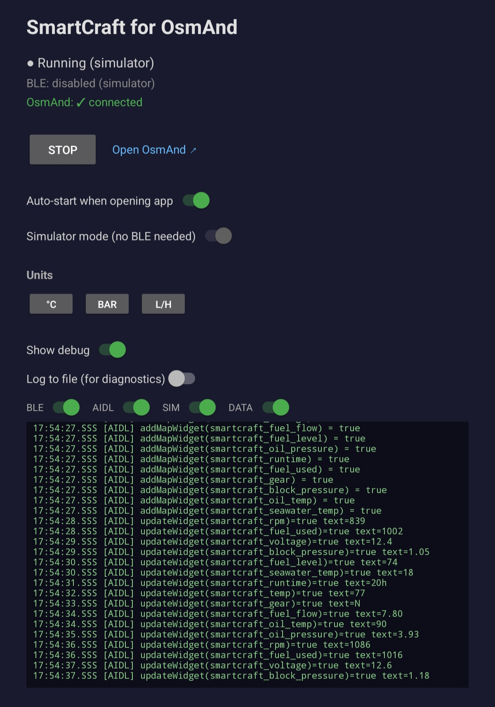

# SmartCraft for OsmAnd

[](https://github.com/diaznet/osmand-smartcraft/actions/workflows/ci.yml)

Android app that reads Mercury SmartCraft engine data via Bluetooth LE and displays it as widgets in OsmAnd.

<p align="center">
  
</p>

See it in action in OsmAnd:

<p align="center">
  <video src="assets/demo_osmand.mp4" width="50%" controls></video>
</p>

## Architecture

```
┌─────────────────────┐       BLE      ┌──────────────────────┐
│  Mercury SmartCraft │◄──────────────►│  SmartCraftService   │
│  BLE Gateway        │  notifications │  (Foreground Service)│
└─────────────────────┘                │                      │
                                       │  SmartCraftParser    │
                                       │  (protocol decode)   │
                                       └──────────┬───────────┘
                                                  │ AIDL
                                       ┌──────────▼───────────┐
                                       │  OsmAnd              │
                                       │  (map widgets)       │
                                       │  RPM | Speed | Temp  │
                                       └──────────────────────┘
```

## Widgets

| Widget ID | Metric | Unit |
|-----------|--------|------|
| smartcraft_rpm | Engine RPM | RPM |
| smartcraft_temp | Coolant temperature | °C / °F |
| smartcraft_voltage | Battery voltage | V |
| smartcraft_fuel_flow | Fuel consumption | L/h / gal/h |
| smartcraft_fuel_level | Fuel tank level | % |
| smartcraft_oil_pressure | Oil pressure | kPa / bar / PSI |
| smartcraft_runtime | Engine hours | h |
| smartcraft_fuel_used | Fuel used (trip) | raw |
| smartcraft_gear | Gear (N/F/R) | — |
| smartcraft_block_pressure | Block pressure | kPa / bar / PSI |
| smartcraft_oil_temp | Oil temperature | °C / °F |
| smartcraft_seawater_temp | Seawater temperature | °C / °F |

## Prerequisites

- Android device with BLE support
- OsmAnd free installed
- Mercury SmartCraft BLE gateway (VesselView Mobile or compatible)

## Build

```bash
./gradlew assembleDebug
```

## Test

```bash
./gradlew test
```

## Release

Tag a version on `main` to trigger a GitHub Release:

```bash
git tag v1.0.0
git push origin v1.0.0
```

## Usage

1. Install the APK on your Android device
2. Open the app and tap "Start / Stop"
3. Grant Bluetooth and location permissions
4. The app will scan for a SmartCraft BLE gateway (device name pattern: `VVM_<address>`)
5. Once connected, widgets appear in OsmAnd's map view
6. Enable widgets in OsmAnd: Menu → Configure Screen → check SmartCraft widgets

## Notes

- Icons use OsmAnd's built-in OBD widget drawables (`widget_obd_*`).
- Targets OsmAnd free (`net.osmand`). Change `OSMAND_PACKAGE` in `OsmAndBridge.kt` for OsmAnd+.
- Units (°C/°F, kPa/bar/PSI, L/h/gal/h) are configurable in the app.
- See [PROTOCOL.md](PROTOCOL.md) for BLE protocol details and reverse engineering notes.
