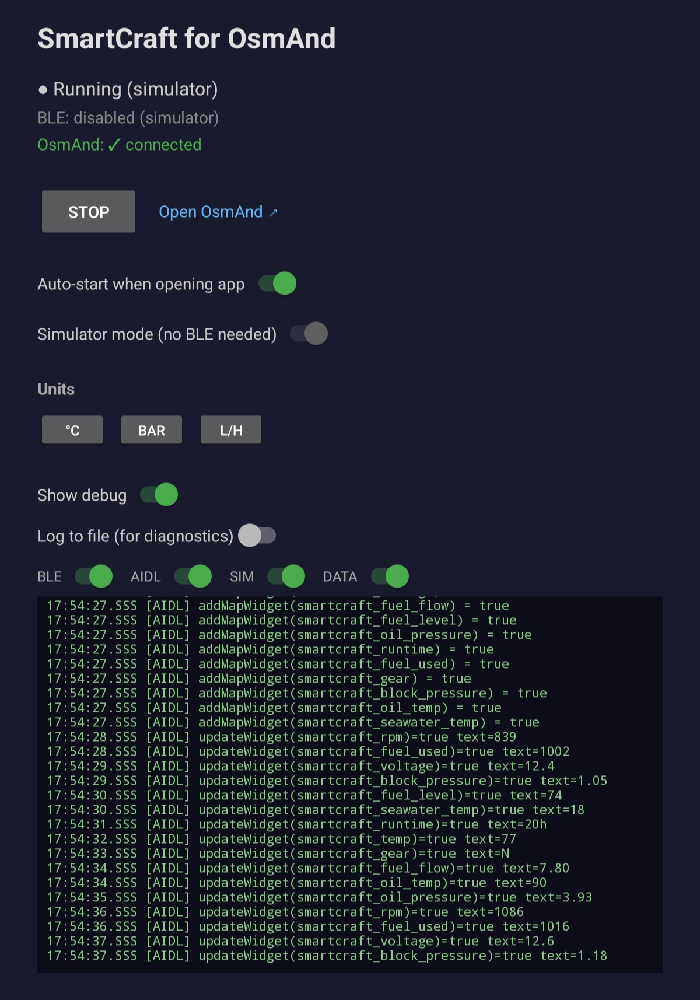

# SmartCraft for OsmAnd

[](https://github.com/diaznet/osmand-smartcraft/actions/workflows/ci.yml)

Android app that reads Mercury SmartCraft engine data via Bluetooth LE and displays it as widgets in OsmAnd.

<p align="center">
  
</p>

See it in action in OsmAnd:

https://github.com/user-attachments/assets/3f409dc6-4260-4583-a756-5dcba74a27a7


## Architecture

```
┌─────────────────────┐       BLE      ┌──────────────────────┐
│  Mercury SmartCraft │◄──────────────►│  SmartCraftService   │
│  BLE Gateway        │  notifications │  (Foreground Service)│
└─────────────────────┘                │                      │
                                       │  SmartCraftParser    │
                                       │  (protocol decode)   │
                                       └──────────┬───────────┘
                                                  │ AIDL
                                       ┌──────────▼───────────┐
                                       │  OsmAnd              │
                                       │  (map widgets)       │
                                       │  RPM | Speed | Temp  │
                                       └──────────────────────┘
```

## Widgets

| Widget ID | Metric | Unit | Source |
|-----------|--------|------|--------|
| smartcraft_rpm | Engine RPM | RPM | BLE |
| smartcraft_temp | Coolant temperature | °C / °F | BLE |
| smartcraft_voltage | Battery voltage | V | BLE |
| smartcraft_fuel_flow | Fuel consumption | L/h / gal/h | BLE |
| smartcraft_fuel_level | Fuel tank level | % | BLE |
| smartcraft_oil_pressure | Oil pressure | kPa / bar / PSI | BLE |
| smartcraft_runtime | Engine hours | h | BLE |
| smartcraft_fuel_used | Fuel used (trip) | raw | BLE |
| smartcraft_gear | Gear (N/F/R) | — | BLE |
| smartcraft_block_pressure | Block pressure | kPa / bar / PSI | BLE |
| smartcraft_oil_temp | Oil temperature | °C / °F | BLE |
| smartcraft_seawater_temp | Seawater temperature | °C / °F | BLE |
| smartcraft_fuel_efficiency | Fuel efficiency (fuel flow ÷ GPS speed) | km/L / L/100km / NM/L / L/NM / mpg | Calculated (engine fuel flow + phone GPS) |

## Prerequisites

- Android device with BLE support
- [OsmAnd](https://play.google.com/store/apps/details?id=net.osmand) or [OsmAnd+](https://play.google.com/store/apps/details?id=net.osmand.plus) installed (Google Play; see [osmand.net](https://osmand.net/) for other sources)
- Mercury SmartCraft BLE gateway ([VesselView Mobile](https://www.mercurymarine.com/gauges-and-controls/displays/vesselview-mobile) or compatible)

## Build

```bash
./gradlew assembleDebug
```

## Test

```bash
./gradlew test
```

## Release

1. Bump `appVersionName` and `appVersionCode` in `gradle.properties` (versionCode = X×10000 + Y×100 + Z, e.g. `1.0.4` → `10004`).
2. Add release notes to `fastlane/metadata/android/en-US/changelogs/<versionCode>.txt` (shown on F-Droid).
3. Tag the version on `main` to trigger a GitHub Release (CI fails if the tag doesn't match `gradle.properties`):

```bash
git tag v1.0.4
git push origin v1.0.4
```

## Usage

1. Install the APK on your Android device
2. Open the app and tap "Start / Stop"
3. Grant Bluetooth and location permissions
4. The app will scan for a SmartCraft BLE gateway (device name pattern: `VVM_<address>`)
5. Once connected, widgets appear in OsmAnd's map view
6. Enable widgets in OsmAnd: Menu → Configure Screen → check SmartCraft widgets

## Notes

- Icons use OsmAnd's built-in OBD widget drawables (`widget_obd_*`).
- Targets OsmAnd free (`net.osmand`) or OsmAnd+ (`net.osmand.plus`). Use the target selector in the app (Auto / OsmAnd / OsmAnd+). Auto mode prefers OsmAnd+ if installed.
- Units are configurable in the app: temperature (°C / °F), pressure (kPa / bar / PSI), fuel flow (L/h / gal/h) and fuel efficiency (km/L, L/100km, NM/L, L/NM or US mpg).
- Fuel efficiency is calculated from the engine's fuel flow and the phone's GPS speed over ground, each averaged over the last 10 s. It shows `--` below 4 km/h (~2 kn), when GPS has no fix, or when the engine reports no fuel flow. Default unit: km/L.
- See [PROTOCOL.md](PROTOCOL.md) for BLE protocol details and reverse engineering notes.

## License

Licensed under the [Apache License 2.0](LICENSE). You may use, modify and redistribute this project, including in commercial or closed-source apps, provided you keep the copyright notice and the [NOTICE](NOTICE) file, credit this project, and state any changes you made.
